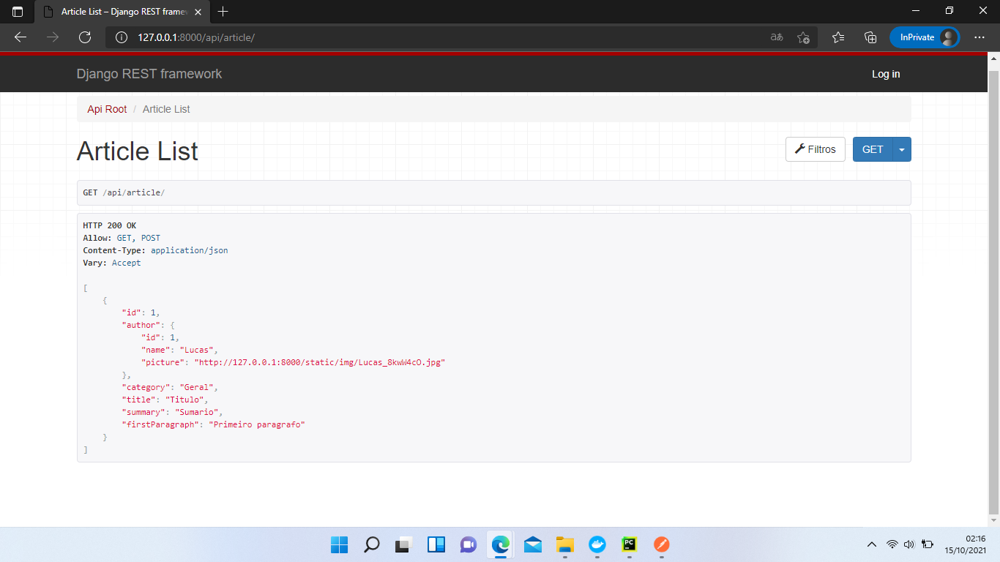

# Desafio API(articles)
Criando uma aplicação com Django RestFull Framework

## Qual objetivo da aplicação?
O objetivo da aplicação é desenvolver e mostrar as seguintes habilidades.


- REST architecture;
- Authentication and permissions;
- Data modeling and migrations;
- PostgreSQL database;
- Query optimization;
- Serialization;
- Production builds (using Docker).


## Como usar uma aplicação em django?

Execute os seguintes comandos se for a primeira vez que
esteja usando a aplicação

`python manage.py migrate`

`python manage.py createsuperuser`

`python manage.py runserver`

para acessar a aplicação entre no seguinte link

http://127.0.0.1:8000

## Como rodar em modo desenvolvimento?

Em settings.py, mude o DEBUG para True

antes


depois


A importância de deixar o DEBUG no modo False
em produção é para evitar alguns problemas de
segurança, como a enumeração de diretorios que é
uma das primeiras etapas de um invasor e com isso
dificultando o acesso a informação a este.


## Como rodar em produção em docker?

```docker-compose up``` inicia e cria as imagens da aplicação


## Login API 
`/api/login/`

As autenticações da aplicação é feita em Basic Auth, 
Para a verificação se seu usário é válido faça um post em
http://127.0.0.1:8000/api/login/
no body com as keys username e password como na imagem
abaixo


Existem 3 formas de retorno

`sucess` com retorno 200 quando a conta existe com sucesso

`401 Unauthorized` com retorno 401, quando o usuário não existe ou a senha está errada

`Use POST` com retorno 200, quando o metodo é diferente de post


## Sign-up API 
`/api/sign-up/`

Para a criação de se seu usário é válido faça um post em
http://127.0.0.1:8000/api/sign-up/
no body com as keys username e password como na imagem
abaixo


Existem 3 formas de retorno

`Sucess` com retorno 200 quando o usuário foi registrado com sucesso

`400 Bad Request` com retorno 400, quando o usuário já existe

`Use POST` com retorno 200, quando o metodo é diferente de post


# Administrator restricted APIs:


Local onde se pode deletar,pegar,criar e editar qualquer dado da aplicação


#List article endpoint 

` /api/articles/?category=:slug` 

Exemplo
```json
[
  {
    "id": "39df53da-542a-3518-9c19-3568e21644fe",
    "author": {
      "id": "2d460e48-a4fa-370b-a2d0-79f2f601988c",
      "name": "Author Name",
      "picture": "https://picture.url"
    },
    "category": "Category",
    "title": "Article title",
    "summary": "This is a summary of the article"
  },
  ...
]
```


Aplicação
```json
[
    {
        "id": 1,
        "author": {
            "id": 1,
            "name": "Lucas",
            "picture": "http://127.0.0.1:8000/static/img/Lucas_8kwW4cO.jpg"
        },
        "category": "Geral",
        "title": "Titulo",
        "summary": "Sumario"
    }
]
```


`/api/articles/:id/`
Anonymous

Exemplo
```json
{
  "id": "39df53da-542a-3518-9c19-3568e21644fe",
  "author": {
    "id": "2d460e48-a4fa-370b-a2d0-79f2f601988c",
    "name": "Author Name",
    "picture": "https://picture.url"
  },
  "category": "Category",
  "title": "Article title",
  "summary": "This is a summary of the article",
  "firstParagraph": "<p>This is the first paragraph of this article</p>"
}
```

Aplicação
```json
[
    {
        "id": 1,
        "author": {
            "id": 1,
            "name": "Lucas",
            "picture": "http://127.0.0.1:8000/static/img/Lucas_8kwW4cO.jpg"
        },
        "category": "Geral",
        "title": "Titulo",
        "summary": "Sumario",
        "firstParagraph": "Primeiro paragrafo"
    }
]
```

Logged user
Exemplo
```json
{
  "id": "39df53da-542a-3518-9c19-3568e21644fe",
  "author": {
    "id": "2d460e48-a4fa-370b-a2d0-79f2f601988c",
    "name": "Author Name",
    "picture": "https://picture.url"
  },
  "category": "Category",
  "title": "Article title",
  "summary": "This is a summary of the article",
  "firstParagraph": "<p>This is the first paragraph of this article</p>",
  "body": "<div><p>Second paragraph</p><p>Third paragraph</p></div>"
}
```

Aplicação
```json
[
    {
        "id": 1,
        "author": {
            "id": 1,
            "name": "Lucas",
            "picture": "http://127.0.0.1:8000/static/img/Lucas_8kwW4cO.jpg"
        },
        "category": "Geral",
        "title": "Titulo",
        "summary": "Sumario",
        "firstParagraph": "Primeiro paragrafo",
        "body": "Corpo"
    }
]
```

Imagem Exemplo

Anonymous Visualização no postman


#Observações

http://127.0.0.1:8000/

A aplicação não é acessível apenas pelo Postman, tem toda uma interface web como podemos ver aqui


http://127.0.0.1:8000/api/article/ (Logado)


http://127.0.0.1:8000/api/article/ (Anonymous)


http://127.0.0.1:8000/api/article/?category=Geral  (Filtrar categoria por "Geral")


http://127.0.0.1:8000/api/article/1/ 

Pode-se filtrar através do e com os seguintes metodos permitidso
Allow: GET, PUT, DELETE

